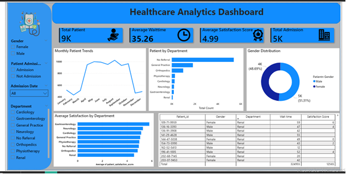

## Healthcare Analytics Dashboard
## Project Overview
This Healthcare Analytics Dashboard was developed to analyze patient trends, hospital
operations, department performance, patient satisfaction, and admission patterns.
The project demonstrates the complete Data Analytics workflow, including:
- Data Cleaning in Excel
- Data Analysis using SQL
- KPI Creation using DAX
- Interactive Dashboard Development in Power BI

## Project Objectives
The main objectives of this project were:
- Analyze patient admission trends over time
- Monitor patient wait times
- Evaluate patient satisfaction across departments
- Identify high-volume departments
- Compare patient distribution by gender
- Build an interactive dashboard for healthcare insights

## Tools & Technologies Used
## Tool Purpose
## Excel Data Cleaning & Preprocessing
MySQL Data Analysis & Querying
Power BI Dashboard Development

## Tool Purpose
DAX KPI & Measure Creation

## Data Cleaning Process
The dataset was cleaned and prepared using Excel and SQL:
- Handled missing values
- Standardized date formats
- Standardized time formats
- Corrected data types
- Removed inconsistencies
- Prepared dataset for reporting and visualization

Key Performance Indicators (KPIs)
The dashboard includes the following KPIs:
## Total Patients
Tracks the total number of patients recorded.
## Total Admissions
Tracks the total admitted patients.
## Average Wait Time
Measures average patient waiting time.
## Average Satisfaction Score
Measures overall patient satisfaction.

## Dashboard Visuals
## Monthly Patient Trends

Analyzes patient volume across different months.
Patients by Department
Shows departments with the highest patient load.
## Gender Distribution
Compares male and female patient counts.
Average Satisfaction by Department
Highlights patient satisfaction performance across departments.
## Patient Details Table
Provides detailed patient-level information for analysis.

## Key Insights
## 1. Patient Volume Trends
Patient visits increased significantly during mid-year months and declined toward the end
of the year.
## 2. Department Workload
No Referral and General Practice departments handled the highest number of patients.
## 3. Patient Satisfaction
Most departments maintained high satisfaction scores, indicating positive patient
experiences.
## 4. Gender Distribution
Patient distribution between male and female patients was relatively balanced.
## 5. Operational Efficiency
Average wait time was approximately 35 minutes, indicating opportunities for workflow
optimization.

## Recommendations
- Increase staffing during peak patient months.

- Monitor high-load departments regularly.
- Reduce patient waiting times through operational improvements.
- Continue tracking satisfaction metrics to improve patient experience.

## Skills Demonstrated
## • Data Cleaning
## • Data Transformation
- SQL Querying
## • Data Analysis
- DAX Measures
- KPI Development
## • Dashboard Design
## • Business Insights Generation
## • Data Visualization

## Dashboard Preview

## Author
## Himanshu Kashyap
Data Analytics Project | Excel | SQL | Power BI | DAX
